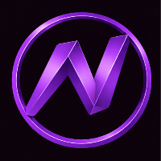

  

<h1 align="center">ON Token (ONLIVE)</h1>

<h3 align="center">Turn ON the World 🌍🌐</h3>

---

## 🌍 Vision

The world’s most important places should not be locked behind borders, tickets, or limitations.

ONLIVE is building a decentralized ecosystem that digitizes monuments, stadiums, museums, and cultural landmarks in immersive 3D and VR.

The ON Token is the economic engine powering that vision.

---

## 🔷 Token Overview

<table>
<tr><td><strong>Token Name</strong></td><td>ON Token</td></tr>
<tr><td><strong>Symbol</strong></td><td>ONLIVE</td></tr>
<tr><td><strong>Network</strong></td><td>Polygon (ERC-20)</td></tr>
<tr><td><strong>Contract</strong></td><td><code>0x14F74e11F8d9D04694Ac9D686cfB188a771b31D94</code></td></tr>
<tr><td><strong>Total Supply</strong></td><td>3,000,000,000 ON</td></tr>
<tr><td><strong>Decimals</strong></td><td>18</td></tr>
<tr><td><strong>Type</strong></td><td>Fixed Supply (Non-Inflationary)</td></tr>
<tr><td><strong>Audit</strong></td><td>Cyberscope</td></tr>
</table>

---

## 🔐 Security & Transparency

<ul style="line-height: 1.6;">
  <li>ERC-20 compliant</li>
  <li>No minting functions</li>
  <li>No hidden ownership logic</li>
  <li>Audited smart contract</li>
  <li>Transparent token mechanics</li>
</ul>

Security and long-term credibility are foundational principles of ONLIVE.

---

## 📘 Documentation

<ul style="line-height: 1.6;">
  <li>📄 <a href="./ON_WP_Vers1.pdf">White Paper</a></li>
  <li>🔍 <a href="./Audit.pdf">Audit Report</a></li>
</ul>

---

## 🎬 Official Media Channels

<ul style="line-height: 1.6;">
  <li>▶ YouTube: https://www.youtube.com/channel/UCk1JUMWgLTvyhliqCsu1Brg</li>
  <li>🎵 TikTok: https://www.tiktok.com/@on_onlive</li>
  <li>𝕏 (Twitter): https://x.com/ON_Token</li>
  <li>💬 Discord: https://discord.gg/S4GSvFBnR3</li>
  <li>📢 Telegram: https://t.me/ontoken1</li>
</ul>

---

## 🧠 Integration & Ecosystem

The ON Token is designed for:

<ul style="line-height: 1.6;">
  <li>Wallet integrations (MetaMask, TrustWallet, Polygon apps)</li>
  <li>DEX & CEX listings</li>
  <li>Block explorer verification</li>
  <li>Media & branding usage</li>
  <li>ONLIVE platform access</li>
</ul>

---

## 🏛 Governance & Updates

All major updates, audits, structural adjustments, and ecosystem developments are versioned and documented within this repository.

Transparency is structural, not optional.

---

## ⚖ Legal Notice

The ON Token is a utility token providing access and functionality within the ONLIVE ecosystem.

It does not represent equity, ownership, or financial securities.

Participation should comply with local regulations and applicable laws.

---

© 2026 THE ONLIVE L.L.C. 
<strong>ONLIVE — Turn ON the World 🌍🌐.</strong>

