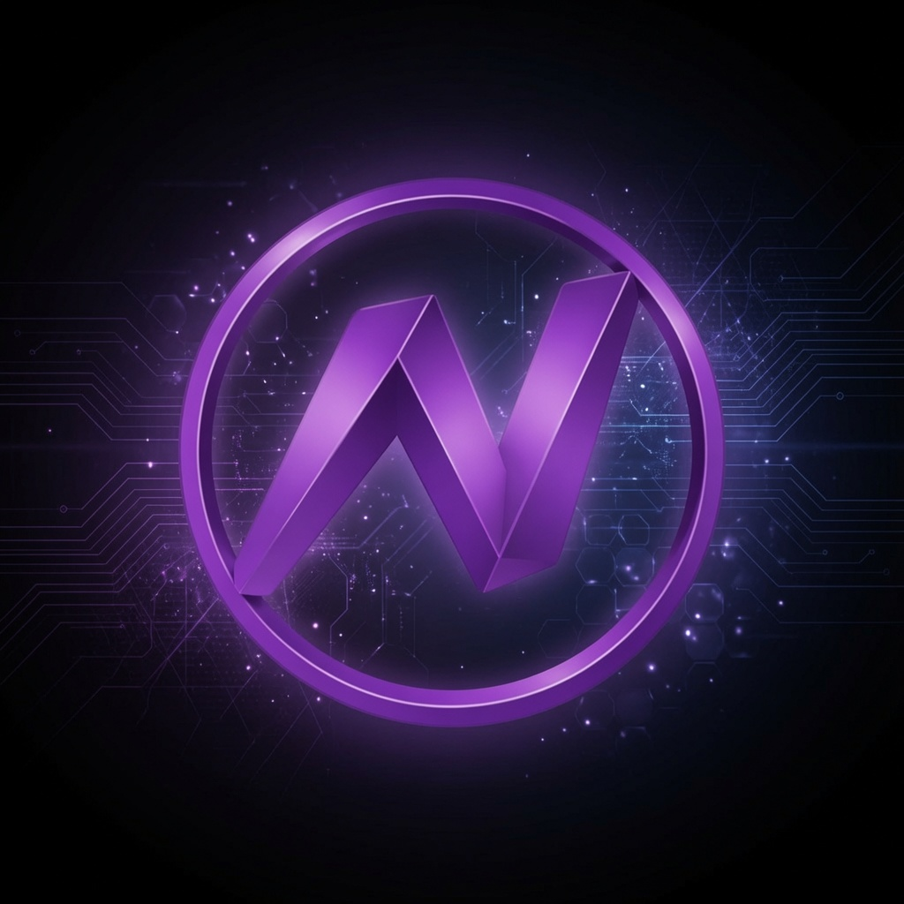

<p align="center">
  
</p>

<h1 align="center">ON Token · ONLIVE</h1>

<p align="center">
  <strong>Connecting the global contributor community.</strong>
</p>

<p align="center">
  The native utility token supporting participation, contribution and ecosystem development within ONLIVE.
</p>

<p align="center">
  <a href="https://onlive.earth">Explore ONLIVE</a> ·
  <a href="https://ontoken.io">ON Token</a> ·
  <a href="./ONLIVE_WP_Vers1.pdf">White Paper</a> ·
  <a href="./Audit.pdf">Audit Report</a>
</p>

---

## ONLIVE

**ONLIVE is building a digital layer of the real world.**

The platform makes real-world places digitally accessible through immersive 360° experiences, virtual reality and interactive visual content.

Cities, landmarks, cultural sites, nature locations, stadiums, public spaces and other meaningful real-world environments can be explored digitally from anywhere.

The long-term vision is simple:

> **Make the world digitally accessible.**

ONLIVE combines global exploration with a contributor-driven ecosystem in which immersive representations of real-world locations can be created, published and discovered.

Published ONLIVE experiences are intended to remain freely accessible.

**No subscription, premium membership, token-based payment or wallet connection is required to explore public ONLIVE experiences.**

[Explore the world on ONLIVE →](https://onlive.earth)

---

## ON Token

The **ON Token** is the native utility token of the ONLIVE ecosystem.

It is intended to support ecosystem participation, creator and contributor recognition, community-oriented distribution, ecosystem coordination and future platform-related functionality.

The ON Token is designed around utility and ecosystem participation.

It does not represent equity, ownership, debt, profit participation, dividends, revenue sharing or any ownership interest in ONLIVE, Kastriot Shabani Consulting L.L.C. or any related entity.

Holding ON is **not required to access public ONLIVE experiences**.

---

## Token Overview

| Property | Details |
|---|---|
| **Token Name** | ON Token |
| **Symbol** | ONLIVE |
| **Network** | Polygon PoS |
| **Token Standard** | ERC-20 compatible |
| **Contract Address** | `0x14F74e11F0d9D469A4c9D686cfB18a771b31D94f` |
| **Total Supply** | 3,000,000,000 tokens |
| **Decimals** | 18 |
| **Supply Type** | Fixed supply |
| **Additional Minting** | None |
| **Smart Contract Audit** | Cyberscope |

### Official Contract Address

```text
0x14F74e11F0d9D469A4c9D686cfB18a771b31D94f
